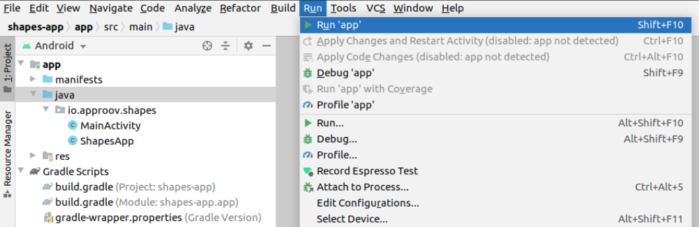
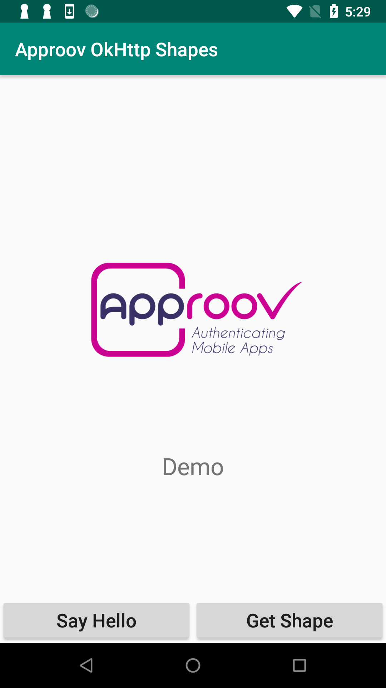
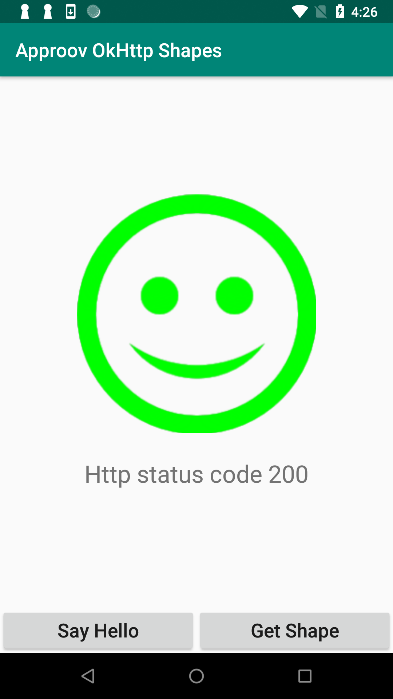
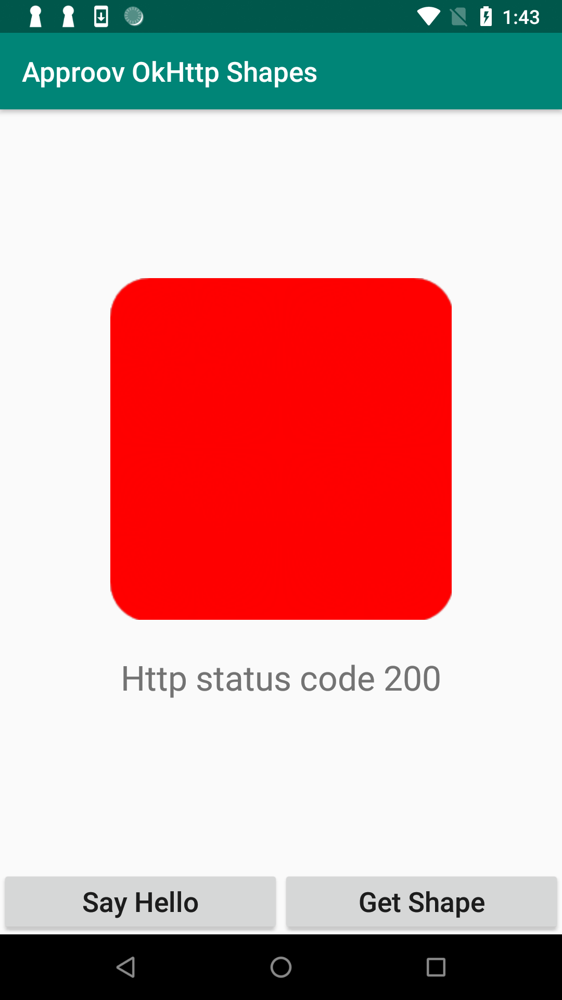
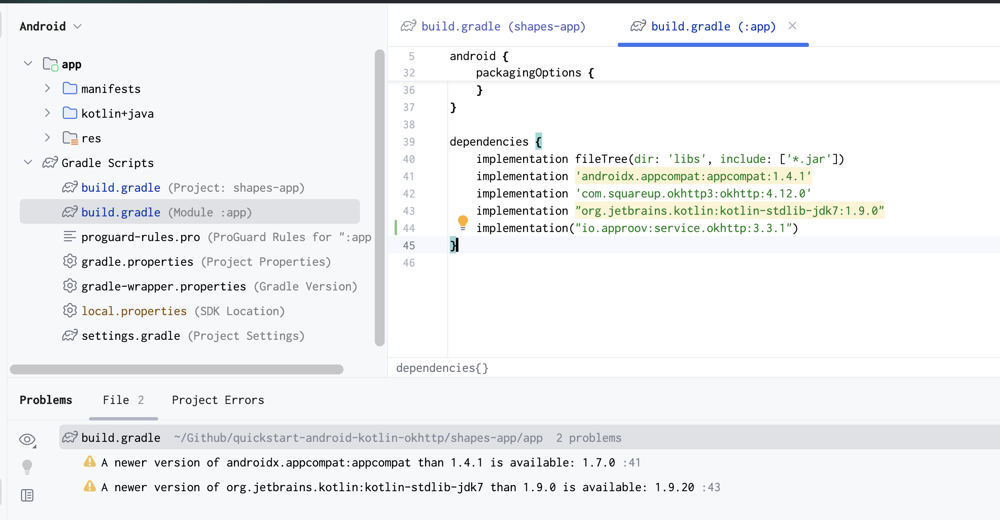
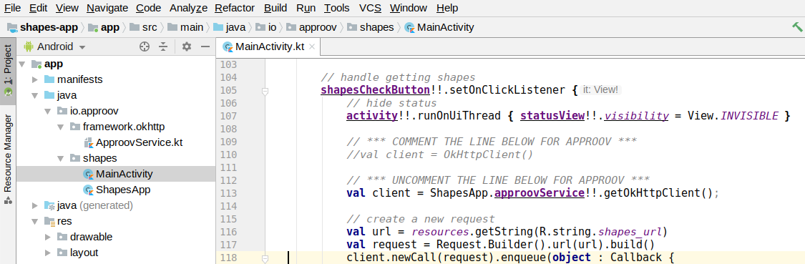
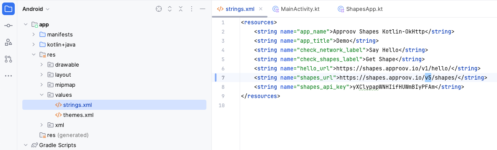
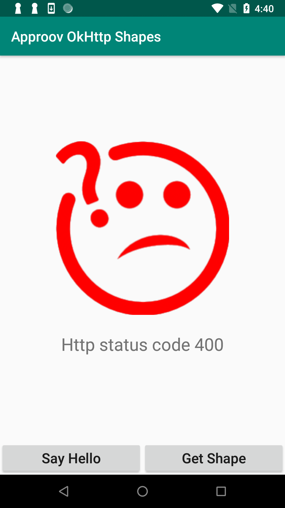
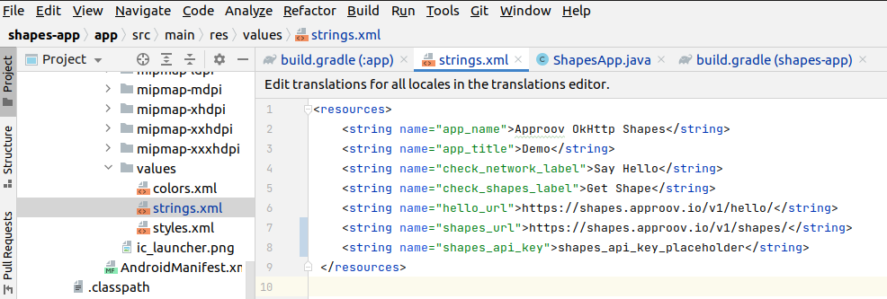
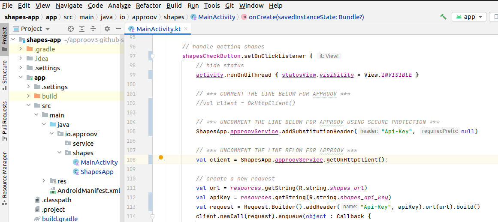

# Approov Worked Tutorial: Android Kotlin OkHttp

This is a worked tutorial for integrating the [Approov Package for OkHttp](https://github.com/approov/approov-service-okhttp) into a native Android app written in Kotlin. It uses a simple `Shapes` app that shows a geometric shape based on a request to an API backend protected with Approov. The steps for integrating the package into your own app are in the [Approov documentation](https://approov.io/docs/latest/); this tutorial shows them applied end to end.

## WHAT YOU WILL NEED
* Access to a trial or paid Approov account
* The `approov` command line tool [installed](https://approov.io/docs/latest/approov-installation/) with access to your account
* [Android Studio](https://developer.android.com/studio) installed
* The contents of this repo

## RUN THE SHAPES APP WITHOUT APPROOV

Open the project in the `shapes-app` folder using `File->Open` in Android Studio. Run the app as follows:



You will see two buttons:

<p>
    
</p>

Click on the `Say Hello` button and you should see this:

<p>
    
</p>

This checks the connectivity by connecting to the endpoint `https://shapes.approov.io/v1/hello`. Now press the `Get Shape` button and you will see this (or a different shape):

<p>
    
</p>

This contacts `https://shapes.approov.io/v1/shapes` to get the name of a random shape. This endpoint is protected with an API key that is built into the code, and therefore can be easily extracted from the app.

The rest of this tutorial shows how the package protects the shapes request with an Approov token and message signatures that the backend verifies, and, as an alternative at the end, how it can remove the API key from the app instead.

## ADD THE APPROOV DEPENDENCY

The package is available from Maven Central, so it is added as a dependency in the `app/build.gradle` file at the app level:



The dependency reference is:

```
implementation("io.approov:service.okhttp:3.7.0")
```

Make sure you do a Gradle sync (by selecting `Sync Now` in the banner at the top of the modified `build.gradle` file) after making this change. The package brings the Approov SDK with it; nothing else needs to be added.

## ENSURE THE SHAPES API IS ADDED

In order for Approov tokens to be generated for the shapes endpoint, it is necessary to inform Approov about it. Execute the following command:

```
approov api -add shapes.approov.io
```

Note that any Approov tokens for this domain will be automatically signed with the specific secret for this domain, rather than the normal one for your account.

## MODIFY THE APP TO USE APPROOV

Uncomment the Approov initialization code in `io/approov/shapes/kotlin_okhttp/ShapesApp.kt`:

```kotlin
try {
    // your Approov account ID, from your onboarding email or "approov sdk -getConfigString"
    ApproovService.initialize(applicationContext, "<your-approov-account-id>")
} catch (e: Exception) {
    // the value passed was not a valid account ID; run without Approov rather than not at all
    Log.e(TAG, "Approov account ID rejected; starting in bypass mode", e)
    ApproovService.initialize(applicationContext, "")
}
```

The package is initialized with your Approov account ID. It is in your onboarding email, or from the Approov CLI at any time (the CLI calls it the SDK config string):

```
approov sdk -getConfigString
```

It looks something like `#123456#K/XPlLtfcwnWkzv99Wj5VmAxo4CrU267J1KlQyoz8Qo=` and is not a secret. Copy it and use it to replace the text `<your-approov-account-id>`. Initialization is guarded because it throws if the value does not arrive complete and unaltered; in that case the app logs the problem and runs without Approov rather than failing to start.

Next we need to use Approov when we make requests for shapes. Uncomment the code in `io/approov/shapes/kotlin_okhttp/MainActivity.kt`:



> **NOTE:** Don't forget to comment out the previous line, the one using the standard `OkHttpClient()`.

Note that you also need to uncomment the `ApproovService` import line near the start of the file.

Instead of using a default `OkHttpClient` we instead make the call using a client provided by the `ApproovService`. Each request it sends to the shapes domain carries an Approov token, the proof of attestation, both message signatures over the request and the `Approov-Status` header, over a TLS connection validated against the trust roots Approov manages for your account. Nothing else in the app changes: the request is sent whatever the attestation outcome, and the backend decides.

You should also edit the `res/values/strings.xml` file to change to using the shapes `https://shapes.approov.io/v5/shapes/` endpoint, which checks the Approov token and the message signature as well as the API key built into the app:



Finally, configure Approov to include the public message signing key in the Approov token. The v5 endpoint uses it to verify the message signature:

```
approov policy -setInstallPubKey on
```

## ADD YOUR SIGNING CERTIFICATE TO APPROOV

In order for Approov to recognize the app as being valid, the local certificate used to sign the app needs to be added to Approov. The following assumes it is in PKCS12 format:

```
approov appsigncert -add ~/.android/debug.keystore -storePassword android -autoReg
```

This ensures that any app signed with the certificate used on your development machine will be recognized by Approov. See [Android App Signing Certificates](https://approov.io/docs/latest/approov-usage-documentation/#android-app-signing-certificates) if your keystore format is not recognized or if you have any issues adding the certificate.

> **IMPORTANT:** The addition takes up to 30 seconds to propagate across the Approov Cloud Infrastructure so don't try to run the app again before this time has elapsed.

## SHAPES APP WITH APPROOV API PROTECTION

Run the app and press the `Get Shape` button. You should now see this (or another shape):

<p>
    
</p>

This means that the app is obtaining a validly signed Approov token and signing each request, and the shapes endpoint has verified both.

> **NOTE:** Running the app on an emulator will not provide valid Approov tokens. You will need to ensure it always passes on your device (see below).

## WHAT IF I DON'T GET SHAPES

If you don't get a valid shape you will see this instead:

<p>
    
</p>

This means the shapes endpoint has rejected the request. The app itself never stops a request because of the attestation outcome: when no token could be obtained the request is still sent, with an empty `Approov-Token` header and the reason in the `Approov-Status` header, and the backend rejects it. Remember this may be because the device you are using has some characteristics that cause rejection for the currently set [Security Policy](https://approov.io/docs/latest/approov-usage-documentation/#security-policies) on your account. Things to try:

* Ensure that the version of the app you are running is signed with the correct certificate.
* If you are running the app from a debugger then valid tokens are not issued.
* Look at the [`logcat`](https://developer.android.com/studio/command-line/logcat) output from the device. The package logs the [loggable form](https://approov.io/docs/latest/approov-usage-documentation/#loggable-tokens) of each token result at the `DEBUG` level; its `arc` claim says why the attestation produced that result, and `approov token -check` decodes it.
* Use `approov metrics` to see [Live Metrics](https://approov.io/docs/latest/approov-usage-documentation/#metrics-graphs) of the cause of failure.
* You can use a debugger or emulator and get valid Approov tokens on a specific device by ensuring you are [forcing a device ID to pass](https://approov.io/docs/latest/approov-usage-documentation/#forcing-a-device-id-to-pass). As a shortcut, you can use `latest` so that the device ID doesn't need to be extracted from the logs or an Approov token.
* Also, you can use a debugger or Android emulator and get valid Approov tokens on any device if you [mark the signing certificate as being for development](https://approov.io/docs/latest/approov-usage-documentation/#development-app-signing-certificates).

## ALTERNATIVE: SHAPES APP WITH SECRETS PROTECTION

This section provides an illustration of an alternative option for Approov protection if you are not able to modify the backend to add an Approov token check.

Firstly, revert the change to `res/values/strings.xml` so that the app uses `https://shapes.approov.io/v1/shapes/`, which simply checks for an API key. The `shapes_api_key` should also be changed to `shapes_api_key_placeholder`, removing the actual API key out of the code:



You must inform Approov that it should map `shapes_api_key_placeholder` to `yXClypapWNHIifHUWmBIyPFAm` (the actual API key) in requests as follows:

```
approov secstrings -addKey shapes_api_key_placeholder -predefinedValue yXClypapWNHIifHUWmBIyPFAm
```

> Note that this command requires an [admin role](https://approov.io/docs/latest/approov-usage-documentation/#account-access-roles).

Next we need to inform Approov that it needs to substitute the placeholder value for the real API key on the `Api-Key` header. Only a single line of code needs to be changed in `io/approov/shapes/kotlin_okhttp/MainActivity.kt`:



Build and run the app again and press the `Get Shape` button. You should now see this (or another shape):

<p>
    
</p>

This means that the app is able to access the API key, even though it is no longer embedded in the app configuration, and provide it to the shapes request. If the app cannot be attested the substitution does not happen: the request is sent with the placeholder still in the header and the endpoint rejects it, so the real key never reaches a device that fails attestation.
